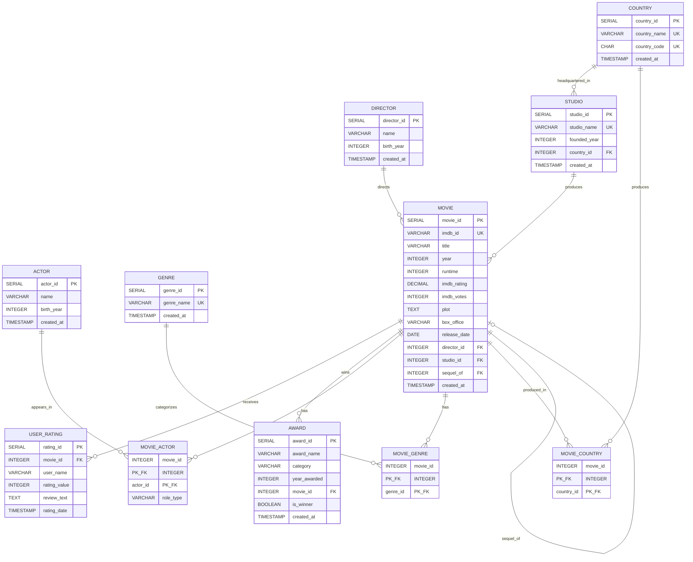

# Movie Database - Conceptual Schema (ER Diagram)

**Student:** Ozturk Eren  
**Login:** xozte001  
**Database:** xozte001  
**Server:** db.kii.pef.czu.cz  
**Date:** 2025-11-29

---

## Entity-Relationship Diagram

---

## Entity Summary

| Entity Type | Entity Name | Description |
|-------------|-------------|-------------|
| Primary | DIRECTOR | Film directors with name and birth year |
| Primary | ACTOR | Film actors with name and birth year |
| Primary | GENRE | Film genre categories (Action, Comedy, etc.) |
| Primary | COUNTRY | Countries for production origins |
| Primary | STUDIO | Production studios/companies |
| Primary | MOVIE | Central entity - core movie information |
| Primary | USER_RATING | User-submitted ratings and reviews |
| Primary | AWARD | Awards and nominations received |
| Binding | MOVIE_ACTOR | M:N relationship movies-actors |
| Binding | MOVIE_GENRE | M:N relationship movies-genres |
| Binding | MOVIE_COUNTRY | M:N relationship movies-countries |

**Total Primary Entities:** 8  
**Total Binding Entities:** 3  
**Total Tables:** 11

---

## Relationship Summary

| Relationship | Type | From | To | Description |
|--------------|------|------|-----|-------------|
| directs | 1:N | DIRECTOR | MOVIE | One director directs many movies |
| produces | 1:N | STUDIO | MOVIE | One studio produces many movies |
| headquartered_in | N:1 | STUDIO | COUNTRY | Studios located in countries |
| receives_rating | 1:N | MOVIE | USER_RATING | Movies receive user ratings |
| wins_award | 1:N | MOVIE | AWARD | Movies receive awards |
| acts_in | M:N | ACTOR | MOVIE | Actors appear in movies |
| has_genre | M:N | MOVIE | GENRE | Movies belong to genres |
| produced_in | M:N | MOVIE | COUNTRY | International co-productions |
| sequel_of | 1:N | MOVIE | MOVIE | Self-reference: sequel points to original |

---

## Loops Discussion

**Statement:** YES, there IS a circular dependency (loop) in this database model.

**The Loop - Self-Referencing MOVIE Entity:**
The MOVIE table contains a `sequel_of` column that references `movie_id` within the same table. This creates a self-referencing foreign key relationship where a movie can point to another movie as its predecessor/original. For example, "The Dark Knight Rises" might reference "The Dark Knight" which references "Batman Begins."

**Why This Loop Exists:**
Movie franchises naturally form sequel chains. The `sequel_of` relationship models this real-world requirement, allowing queries like "find all sequels to Inception" or "trace the entire franchise history."

**Technical Implications:**
- **Recursive Queries:** Requires WITH RECURSIVE CTEs to traverse sequel chains
- **Insertion Order:** Must insert original movies before sequels
- **CASCADE Behavior:** ON DELETE SET NULL prevents orphan sequel references
- **Cycle Prevention:** Application logic must prevent circular sequel chains (A→B→A)

**Benefits:**
This loop provides valuable functionality by enabling franchise analysis, sequel chain traversal, and maintaining relationships between related movies in a normalized structure.
